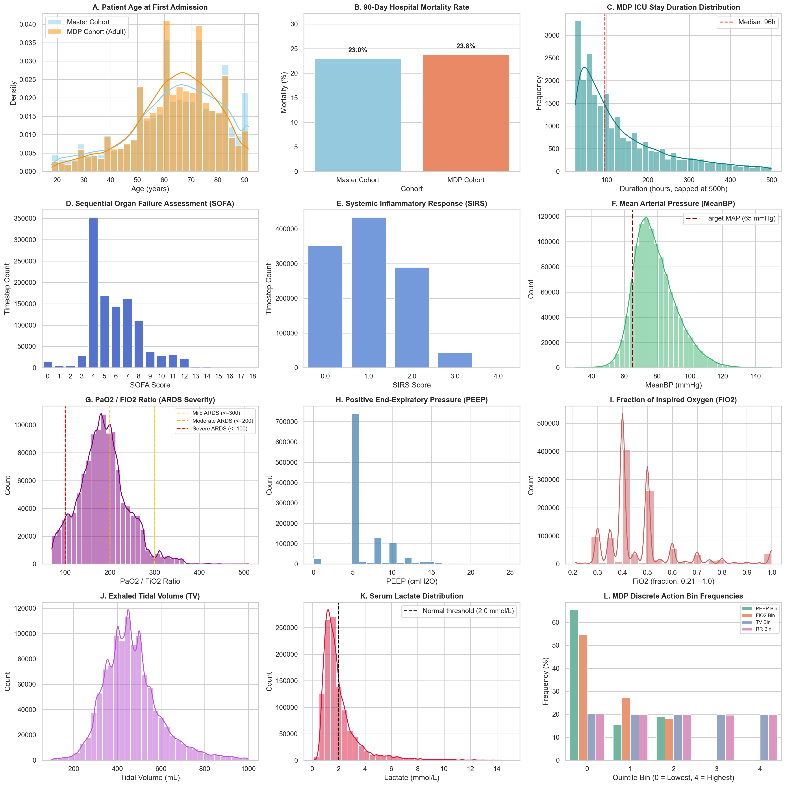
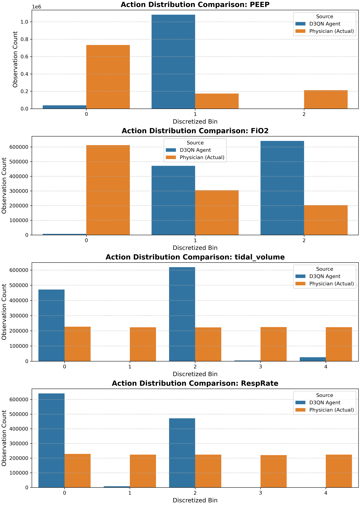

# MIMIC-IV Sepsis & Mechanical Ventilation RL Pipeline

A production-grade, end-to-end data preparation and reinforcement learning pipeline for optimizing mechanical ventilation weaning and control in critically ill ICU patients, built using **MIMIC-IV 3.0** and **Dueling Double Deep Q-Networks (D3QN)** with PyTorch.

---

## Table of Contents
1. [Project Overview](#1-project-overview)
2. [Quickstart & Execution Guide (Which Exact Code to Run)](#2-quickstart--execution-guide-which-exact-code-to-run)
3. [Patient Cohort Overview & Gender Distribution](#3-patient-cohort-overview--gender-distribution)
4. [Cumulative Fluid Balance: Logic & Clinical Interpretation](#4-cumulative-fluid-balance-logic--clinical-interpretation)
5. [Capping & Flooring (Winsorization) vs. Raw Distribution](#5-capping--flooring-winsorization-vs-raw-distribution)
6. [Exact Action Variables Bin Cutoffs (225 Actions)](#6-exact-action-variables-bin-cutoffs-225-actions)
7. [MDP Cohort Selection & Missing Value Imputation](#7-mdp-cohort-selection--missing-value-imputation)
8. [Pipeline Architecture & Modules](#8-pipeline-architecture--modules)
9. [Repository & Results Inventory](#9-repository--results-inventory)
10. [Data Safety & Security](#10-data-safety--security)

---

## 1. Project Overview

Mechanical ventilation is a lifesaving intervention in acute hypoxemic respiratory failure and sepsis, but prolonged ventilation induces ventilator-induced lung injury (VILI), ventilator-associated pneumonia (VAP), and diaphragmatic atrophy. Conversely, premature extubation leads to reintubation and increased mortality.

This repository converts research notebooks into a modular Python pipeline that:
- Reads raw MIMIC-IV tables directly from Google Drive or local storage in read-only mode.
- Extracts patient demographics, high-frequency vitals, laboratory tests, vasopressor dose rates, fluid balances, and organ dysfunction scores (SOFA, SIRS, Elixhauser).
- Resamples data into uniform 4-hour clinical decision windows.
- Builds an adult mechanical ventilation cohort ($\ge 24$h ventilation).
- Imputes missing physiological data and clusters states using K-Means ($K=500$).
- Discretizes ventilator actions (PEEP, $\text{FiO}_2$, Tidal Volume, Respiratory Rate) into $3 \times 3 \times 5 \times 5 = 225$ discrete actions.
- Trains and evaluates a D3QN agent with PyTorch to recommend personalized lung-protective ventilation settings.

---

## 2. Quickstart & Execution Guide (Which Exact Code to Run)

All executable Python scripts are located in [`scripts/`](scripts/). Run them from the project root directory:

### A. Run Cohort Distribution Analysis & Generate 12-Panel Plot
To calculate cohort distributions and generate the publication-grade 12-panel clinical figure:
```bash
python scripts/analyze_patient_distribution.py
```
- **Outputs generated**:
  - `results/patient_data_distribution.png` (12-panel figure)
  - `results/patient_cohort_distribution_summary.csv`
  - `results/patient_vitals_labs_distribution.csv`

### B. Run Complete Variable Summary (With & Without Capping/Flooring)
To compute summary statistics (Valid Count, Missing Count, Missing %, Min, P25, Median, P75, Max, IQR, Raw Mean/Std, and Capped Mean/Std) across all ~52 variables:
```bash
python scripts/generate_full_variable_summary.py
```
- **Outputs generated**:
  - `results/patient_variables_summary_comparison.csv` (Side-by-side Table 1 comparison)
  - `results/patient_variables_summary_all.csv` (Long stacked table)
  - `results/patient_variables_summary_raw.csv` (Un-floored & un-capped summary)

### C. Compute Exact Action Variables Bin Cutoffs
To print and export the empirical ranges, medians, and sample counts for the 4 action variables:
```bash
python scripts/compute_action_bin_cutoffs.py
```
- **Outputs generated**:
  - `results/action_variables_bin_cutoffs.csv`

### D. Run Pipeline Stages via Master Orchestrator
```bash
# Verify syntax of all scripts
python3 -m py_compile scripts/*.py

# Run individual pipeline stages:
python scripts/run_pipeline.py --stage patient       # Stage 1: Demographics, GCS, Vitals, Elixhauser
python scripts/run_pipeline.py --stage lab           # Stage 2: Labs, Fluid Balance, IV, Urine
python scripts/run_pipeline.py --stage vasopressors   # Stage 3: 5 Vasopressor dose calculations
python scripts/run_pipeline.py --stage ventilation   # Stage 4: Vent parameters & combined vasopressors
python scripts/run_pipeline.py --stage sampling      # Stage 5: 4h window binning & patient aggregation
python scripts/run_pipeline.py --stage scores        # Stage 6: SIRS, SOFA, and master dataset merge
python scripts/run_pipeline.py --stage prep          # Stage 7: Imputation, clustering, MDP transitions
python scripts/run_pipeline.py --stage rl            # Stage 8: D3QN PyTorch training & evaluation

# Run full end-to-end pipeline:
python scripts/run_pipeline.py --stage all
```

---

## 3. Patient Cohort Overview & Gender Distribution

The pipeline produces two main datasets:
1. **Full Master Dataset (`final_patient_dataset_master.csv`)**: All ICU patients resampled into 4-hour intervals without filtering.
2. **MDP Research Cohort (`final_patient_dataset_mdp.csv`)**: Filtered for adult patients ($\ge 18$ years) who received mechanical ventilation for at least 24 hours, with physiological imputation and clustering.

### Cohort Overview

| Cohort Metric | Full Master Dataset (Unfiltered) | MDP Research Cohort |
| :--- | :---: | :---: |
| **Total 4h Timesteps** | **2,248,324** | **1,120,403** |
| **Unique Patients (`subject_id`)** | **65,366** | **19,550** |
| **Unique Hospital Admissions (`hadm_id`)** | **85,242** | **23,211** |
| **Unique ICU Stays (`stay_id`)** | **94,458** | **25,036** |
| **Mean Age (Years)** | **63.93** ($\pm 16.24$) | **63.09** ($\pm 15.66$) |
| **90-Day In-Hospital Mortality** | **23.01%** | **23.82%** |
| **Median ICU Stay Duration** | ~48.0 hours | **68.0 hours** (IQR: 36.0 – 136.0h) |

### Gender Distribution
Gender is explicitly tracked in both datasets (`gender` column with values `'M'` and `'F'`):
- **Full Master Dataset ($N = 2,248,324$)**:
  - **Male**: 1,287,901 (**57.28%**)
  - **Female**: 960,423 (**42.72%**)
  - Missing: **0.0%**
- **MDP Research Cohort ($N = 1,120,403$)**:
  - **Male**: 673,097 (**60.08%**)
  - **Female**: 447,306 (**39.92%**)
  - Missing: **0.0%**

---

## 4. Cumulative Fluid Balance: Logic & Clinical Interpretation

In [`scripts/lab_and_fluid.py`](scripts/lab_and_fluid.py), cumulative fluid balance is calculated as:
$$\text{cum\_fluid\_balance} = \text{in\_cum\_amt} - \text{out\_cum\_amt}$$

The presence of substantial negative values (Median: **$-8,748$ mL** in the MDP cohort) is **not an error**, but reflects two key factors:

1. **Active Clinical De-resuscitation in ICU**:
   - In patients with septic shock and acute respiratory distress syndrome (ARDS), aggressive early fluid resuscitation is followed by active diuresis (loop diuretics like furosemide/Lasix) or continuous renal replacement therapy (CRRT) with net negative ultrafiltration to reduce extravascular lung water.
2. **MIMIC-IV Data Logging Asymmetry**:
   - `outputevents` exhaustively records **every** output event (hourly catheter urine volume, chest tubes, surgical drains, dialysis effluent).
   - `inputevents` only records IV infusions and smart-pump medications given electronically in the ICU; oral fluid intake, enteral feeds, and pre-ICU fluids are frequently absent.
   - Patients who are clinically stable off continuous IV fluids continue to produce 1,500 – 3,000 mL of urine daily. Over a 10–20 day stay, $0\text{ mL input} - 25,000\text{ mL output} = -25,000\text{ mL}$.

---

## 5. Capping & Flooring (Winsorization) vs. Raw Distribution

Raw ICU chart events contain recording typos and sensor artifacts (e.g. PEEP = 8,774,580 cmH2O, Plateau pressure = 211,111,000 cmH2O, Patient weight = 551,558 kg). These extreme outliers artificially inflate raw means and standard deviations.

To present both perspectives, [`scripts/generate_full_variable_summary.py`](scripts/generate_full_variable_summary.py) computes:
- **Raw Distribution**: Unfiltered min, max, mean, and std.
- **Capped & Floored Distribution (Winsorization)**: Values clipped to the **1st percentile (Floor)** and **99th percentile (Cap)**.

### Side-by-Side Comparison Table (Key Clinical Variables)

| Variable | Description | Full Raw Mean $\pm$ Std | Full Capped Mean $\pm$ Std [P1 to P99] | MDP Raw Mean $\pm$ Std | MDP Capped Mean $\pm$ Std [P1 to P99] |
| :--- | :--- | :---: | :---: | :---: | :---: |
| **`first_admit_age`** | Age (years) | $63.93 \pm 16.24$ | **$63.95 \pm 16.19$** [22.0 – 91.4] | $63.09 \pm 15.66$ | **$63.12 \pm 15.56$** [24.0 – 91.4] |
| **`weight`** | Patient Weight (kg) | $89.02 \pm 1476$ | **$84.77 \pm 23.49$** [40.6 – 165.0] | $87.50 \pm 25.89$ | **$87.13 \pm 23.67$** [42.7 – 169.6] |
| **`PEEP`** | PEEP (cmH2O) | $27.36 \pm 11861$ | **$7.11 \pm 3.22$** [0.0 – 18.2] | $18.14 \pm 9002$ | **$6.47 \pm 2.98$** [0.0 – 18.0] |
| **`tidal_volume`** | Tidal Volume (mL) | $482.77 \pm 2337$ | **$461.44 \pm 124.42$** [204 – 910] | $499.28 \pm 1627$ | **$468.44 \pm 139.50$** [150 – 980] |
| **`plateau_pressure`**| Plateau Pressure (cmH2O) | $860.57 \pm 421089$ | **$20.58 \pm 5.45$** [10.4 – 36.0] | $207.53 \pm 199445$ | **$19.04 \pm 4.84$** [9.0 – 33.0] |
| **`FiO2`** | Inspired O2 Fraction (%) | $47.98 \pm 16.01$ | **$48.03 \pm 15.95$** [30.0 – 100.0] | $47.17 \pm 15.35$ | **$47.22 \pm 15.28$** [30.0 – 100.0] |
| **`HeartRate`** | Heart Rate (bpm) | $85.85 \pm 17.28$ | **$85.81 \pm 16.92$** [51.3 – 130.3] | $87.78 \pm 17.29$ | **$87.74 \pm 16.96$** [53.0 – 132.8] |
| **`SysBP`** | Systolic BP (mmHg) | $120.35 \pm 19.67$ | **$120.35 \pm 19.19$** [82.5 – 172.0] | $118.91 \pm 19.32$ | **$118.92 \pm 18.80$** [80.1 – 170.0] |
| **`DiasBP`** | Diastolic BP (mmHg) | $64.07 \pm 13.40$ | **$64.03 \pm 13.05$** [38.0 – 100.1] | $62.16 \pm 12.79$ | **$62.13 \pm 12.44$** [37.0 – 97.3] |
| **`MeanBP`** | Mean Arterial Pressure | $79.90 \pm 13.71$ | **$79.87 \pm 13.28$** [53.8 – 117.5] | $78.79 \pm 13.12$ | **$78.77 \pm 12.65$** [54.0 – 115.5] |
| **`shockindex`** | Shock Index ($SysBP/HR$) | $1.47 \pm 0.40$ | **$1.46 \pm 0.39$** [0.75 – 2.63] | $1.41 \pm 0.38$ | **$1.41 \pm 0.37$** [0.73 – 2.51] |
| **`RespRate`** | Respiratory Rate (bpm) | $20.16 \pm 5.02$ | **$20.14 \pm 4.90$** [10.8 – 34.2] | $20.87 \pm 5.31$ | **$20.86 \pm 5.20$** [10.5 – 35.0] |
| **`SpO2`** | SpO2 Saturation (%) | $96.69 \pm 2.85$ | **$96.76 \pm 2.38$** [89.3 – 100.0] | $96.89 \pm 3.46$ | **$97.02 \pm 2.46$** [88.3 – 100.0] |
| **`PH`** | Arterial pH | $7.36 \pm 0.08$ | **$7.36 \pm 0.08$** [7.11 – 7.53] | $7.37 \pm 0.08$ | **$7.38 \pm 0.07$** [7.16 – 7.53] |
| **`PAO2FiO2ratio`** | PaO2 / FiO2 Ratio | $172.52 \pm 60.05$ | **$172.30 \pm 59.16$** [74.0 – 340.0] | $184.41 \pm 53.99$ | **$184.23 \pm 53.22$** [76.0 – 336.7] |
| **`LACTATE`** | Serum Lactate (mmol/L) | $2.53 \pm 2.29$ | **$2.49 \pm 2.07$** [0.6 – 12.9] | $2.09 \pm 1.68$ | **$2.06 \pm 1.47$** [0.6 – 9.2] |
| **`SOFA`** | SOFA Score | $5.16 \pm 2.22$ | **$5.14 \pm 2.17$** [0.0 – 12.0] | $5.89 \pm 2.36$ | **$5.87 \pm 2.28$** [0.0 – 12.0] |
| **`SIRS`** | SIRS Score | $0.90 \pm 0.86$ | **$0.89 \pm 0.85$** [0.0 – 3.0] | $1.03 \pm 0.86$ | **$1.03 \pm 0.86$** [0.0 – 3.0] |
| **`gcs`** | Glasgow Coma Scale | $11.73 \pm 3.80$ | **$11.73 \pm 3.80$** [3.0 – 15.0] | $10.22 \pm 4.06$ | **$10.22 \pm 4.06$** [3.0 – 15.0] |
| **`cum_fluid_balance`**| Cumulative Fluid (mL) | $-13633 \pm 30943$ | **$-12907 \pm 19252$** | $-18784 \pm 38552$ | **$-17838 \pm 23894$** |
| **`vaso_total`** | Vasopressor Rate | $2.65 \pm 42.88$ | **$2.37 \pm 6.26$** [0.01 – 30.0] | $1.81 \pm 21.64$ | **$1.61 \pm 4.18$** [0.01 – 20.2] |

*(Full table covering all 52 variables available in [`results/patient_variables_summary_comparison.csv`](results/patient_variables_summary_comparison.csv).)*

---

## 6. Exact Action Variables Bin Cutoffs (225 Actions)

In [`scripts/vent_datapreparation.py`](scripts/vent_datapreparation.py), the 4 action variables are discretized using quantile binning (`pd.qcut(q=5, duplicates='drop')`). Because clinical interventions cluster heavily around standard clinical values (e.g. PEEP = 5 cmH2O, $\text{FiO}_2 = 40\%$), duplicate quantile boundaries are dropped, resulting in:
- **PEEP**: 3 bins
- **FiO2**: 3 bins
- **Tidal Volume**: 5 bins
- **Respiratory Rate**: 5 bins
- **Total Discrete Actions**: $3 \times 3 \times 5 \times 5 = 225$ action combinations.

### Bin Definitions & Empirical Ranges (from `results/action_variables_bin_cutoffs.csv`)

| Variable | Bin | Empirical Range | Median | Timestep Count | Percentage | Clinical Meaning |
| :--- | :---: | :---: | :---: | :---: | :---: | :--- |
| **PEEP** | `0` | $[0.00, 5.00]$ cmH2O | **5.00** | 733,044 | 65.43% | Minimal / physiological baseline PEEP |
| **PEEP** | `1` | $(5.00, 8.00]$ cmH2O | **8.00** | 174,485 | 15.57% | Standard lung-protective PEEP |
| **PEEP** | `2` | $> 8.00$ cmH2O | **10.00** | 212,874 | 19.00% | High PEEP (severe ARDS / recruitment) |
| **FiO2** | `0` | $[21.0, 40.0]$ % | **40.00** | 612,359 | 54.66% | Low supplemental oxygen |
| **FiO2** | `1` | $(40.0, 50.0]$ % | **50.00** | 304,987 | 27.22% | Moderate oxygen delivery |
| **FiO2** | `2` | $(50.0, 100.0]$ % | **70.00** | 203,057 | 18.12% | High oxygenation (severe hypoxemia) |
| **`tidal_volume`** | `0` | $[0, 360.0]$ mL | **318.0** | 227,230 | 20.28% | Low TV (lung-protective ARDSnet protocol) |
| **`tidal_volume`** | `1` | $(360.0, 425.0]$ mL | **398.5** | 222,940 | 19.90% | Low-to-moderate TV |
| **`tidal_volume`** | `2` | $(425.0, 480.5]$ mL | **451.5** | 222,203 | 19.83% | Standard adult physiological TV |
| **`tidal_volume`** | `3` | $(480.5, 555.5]$ mL | **511.0** | 224,284 | 20.02% | Moderate-to-high TV |
| **`tidal_volume`** | `4` | $> 555.5$ mL | **638.0** | 223,746 | 19.97% | High tidal volume |
| **`RespRate`** | `0` | $[2.0, 16.25]$ bpm | **14.5** | 228,796 | 20.42% | Basal / resting ventilated rate |
| **`RespRate`** | `1` | $(16.25, 19.00]$ bpm | **17.8** | 223,804 | 19.98% | Mildly elevated rate |
| **`RespRate`** | `2` | $(19.00, 21.75]$ bpm | **20.4** | 223,776 | 19.97% | Standard ventilated rate |
| **`RespRate`** | `3` | $(21.75, 25.20]$ bpm | **23.3** | 220,482 | 19.68% | Tachypneic rate |
| **`RespRate`** | `4` | $(25.20, 68.00]$ bpm | **28.0** | 223,545 | 19.95% | Rapid / hyperventilatory rate |

---

## 7. MDP Cohort Selection & Missing Value Imputation

### A. Cohort Selection Criteria
In `filter_cohort()`:
1. **Adult ICU Patients**: `first_admit_age >= 18`
2. **Mechanical Ventilation Active**: `MechVent == 1`
3. **Stay Duration**: $\text{Duration} \ge 24\text{ hours}$ ($\max(\text{start\_time}) - \min(\text{start\_time}) \ge 24\text{ h}$)

### B. Missing Data Imputation Workflow
In `impute_missing_data()`:
```
Raw 4-Hour Sampled Dataset
   │
   ▼
1. Chronological Sort per Patient:
   Sort by (subject_id, start_time)
   │
   ▼
2. Backward Fill per Subject (bfill):
   Propagates initial laboratory / vital baseline backwards to the start of admission
   │
   ▼
3. Forward Fill per Subject (ffill):
   Carries forward latest valid measurement across clinical intervals
   │
   ▼
4. Cohort Median Imputation:
   Fills any tests never ordered for a specific patient with population median
   │
   ▼
5. Physiological Clamping:
   Clamps negative values (e.g. PEEP < 0 clamped to 0.0)
   │
   ▼
Dense Feature Matrix (0.0% Missing)
```

---

## 8. Pipeline Architecture & Modules

```
scripts/
├── config.py                       # Paths, .env loader & bidirectional filename alias resolution
├── drive_utils.py                  # Google Drive mount verification & read-only enforcement
├── patient_data.py                 # Stage 1: Demographics, GCS, Vitals, Elixhauser comorbidity
├── lab_and_fluid.py                # Stage 2: Labs, fluid balance, IV intake, urine output
├── vasopressors_6files.py          # Stage 3: 5 Vasopressor dose calculations & weight durations
├── ventilation.py                  # Stage 4: Ventilation parameters, status, and combined vasopressors
├── sampling.py                     # Stage 5: 4-hour window binning & master patient dataset merge
├── vent_datapreparation.py         # Stage 7: Imputation, K-Means clustering, MDP transition generation
├── vent_d3qn.py                    # Stage 8: PyTorch D3QN training, policy evaluation & visualization
├── analyze_patient_distribution.py # Cohort distribution metrics & 12-panel publication plot
├── generate_full_variable_summary.py # Full variable summaries (raw vs capped Winsorization)
├── compute_action_bin_cutoffs.py   # Action variables empirical bin cutoffs calculation
├── data_controls.py                # Regex extraction of echocardiogram clinical notes
├── echo_notes_genai.py             # Gemini LLM structured extraction from echo notes
└── run_pipeline.py                 # Master CLI pipeline orchestrator
```

---

## 9. Repository & Results Inventory

Lightweight summary results and publication figures are tracked in [`results/`](results/):

| File | Size | Description |
| :--- | :---: | :--- |
| **`results/patient_variables_summary_comparison.csv`** | 13 KB | Side-by-side Table 1 with raw and capped mean/std and percentiles |
| **`results/patient_variables_summary_raw.csv`** | 12 KB | Summary of all 52 variables without any flooring or capping |
| **`results/patient_variables_summary_all.csv`** | 15 KB | Long stacked table with P1 floor, P99 cap, IQR, and missing percentages |
| **`results/action_variables_bin_cutoffs.csv`** | 1.1 KB | Exact empirical cutoffs for PEEP, FiO2, TV, and RR bins |
| **`results/patient_cohort_distribution_summary.csv`** | 300 B | High-level cohort overview (patients, admissions, stays, age, mortality) |
| **`results/action_distribution_comparison.csv`** | 410 B | Comparison of D3QN agent recommendations vs. clinician choices |
| **`results/patient_data_distribution.png`** | 717 KB | 12-panel publication-grade cohort distribution figure |
| **`results/action_distribution_comparison.png`** | 419 KB | Bar chart comparing D3QN policy vs. clinician policy |

### Distribution Visualizations

#### 12-Panel Clinical Data Distribution


#### D3QN Reinforcement Learning Action Policy Comparison


---

## 10. Data Safety & Security

- **Zero Data Exposure**: Large intermediate and raw MIMIC-IV CSVs (`> 7.5 GB`) in `data/` and all `.pth` model weights are strictly ignored via `.gitignore` to adhere to PhysioNet credentialed health data agreements.
- **Credential Protection**: Private credentials, Google Drive paths, and API keys are stored exclusively in local `.env` (which is gitignored). A sanitized template is provided in `.env.example`.
- **Read-Only Raw Access**: Raw MIMIC-IV 3.0 files are accessed strictly with read-only permissions (`rb`/`r`), ensuring zero modification to original clinical datasets.
